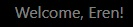

# Astroblog

This highly detailed functioning site is called Astroblog. Astroblog is a django project that truly encapsulates the strengths of the framework. It is an extensive project built for enthusiansts of space and astronomy. Astroblog as the name suggests is a blog there are many highly detailed posts bringing light towards certain theories, events, own recolletions and experiences of many users. The site is designed to allow users to register with Astroblog and take part in the discussions with complete CRUD functionality through leaving comments and posts on the blog whilst also being able to edit or delete them if that is their wish. Throughout this file, you will see just how the Astroblog project came to it's inception and the stages it went through from the initial mockups all the way to the release. 

- Im sure you're intrigured to know how the project came to be but please if you would like to view the live site then just click [here](https://astroblog-5d7f9fc3c6e0.herokuapp.com/)

## Table of Contents

Click here for the Table of Contents

- [Agile Development](#agile-development)
- [CRUD Functionality](#crud-functionality)
- [Entity Relationship](#entity-relationship)
- [Design](#design)
- [Wireframes](#wireframes)
- [Features](#features)
- [User Stories](#user-stories)
- [Pages](#pages)
- [Tools & Technologies](#tools--technologies)
- [Testing](#testing)
- [Deployment](#deployment)
- [Credits](#credits)
- [Acknowledgements](#acknowledgements)

## Agile Development 
- Agile Development was always beating in the heart of this project, The user stories were developed for the project and put onto a project kanban board where times of recollection were taken so the user stories can be viewed and put onto their relevant setting. They could either be set to tasks to do, tasks in progress or tasks completed.
Throughout building this project this board became a second home to collect my thoughts and follow the user stories and iterate improvements and functions during the days it took to make Astroblog. 

- The site really has two seperate epics. The first epic is administration. There were specific user stories guided towards accessibility for a site admin. These included the creation of posts, edits of posts, deletion of posts and comments and even favourited posts from users in the Django Administration. It was paramount to add these for the site admin to control and to add register and login features, this all ensures that in the Django Admin the superuser can delete any unwanted users. 

- The second epic was for creating the functions and accessiblities for the user. The logged in user can create edit delete posts and comment and even favourite posts.

- The project Astroblog has three seperate apps to highlight how versitile Django is as a framework. The paths seemlessly link to eachother even across different apps as you can see in the sites user dashboard/profile. The three apps that were created for this project were blog which was the main app to produce the modals and views that are used throughout the site. The second app was an about app which shows the user what the site is about and what it's tailored to do. In development, the project board with the user stories for the about helped me to set a goal for what the app should contain as it contains a model that fetches data from the database and shows it to the user regardless of whether or not they are logged in. The third app was called dashboard which was created especially just for simplicity and to create a user profile and much more which can be found in the issues that have been closed.

It's important to note that this was all done on GitHub as it provides a great project management tool with the boards and milestones and even labels to add importance to certain user stories such as "must-have" "should-have" although most were must-haves as providing the user with the functions that Astroblog possesses was at the height of the goal.

## CRUD Functionality

*CRUD* functionality has been implemented throughout the project in many different pages such as the profile and even the blog templates where users can comment and even favourite posts. These functions return data to other pages in the site such as the profile if you do favourite another users post then it would appear on your profile. 

Admin (superuser only)
- *C*: Create new users and posts.
- *R*: Read or view all users and posts and comments.
- *U*: Update posts and user information and comments.
- *D*: Delete posts and users and commments.

Dashboard (logged-in users only)
- *C*: Create a new entry by saving a post to the dashboard, also can create comments.
- *R*: View all of the blog posts on Astroblog.
- *U*: Users can click on their posts and edit their posts or delete them.
- *D*: Deletion of Favourite Posts, clicking on comments and posts will take you to them for either editing or deletion.

Content Management (logged-in users only)
- *C*: Create a new post.
- *R*: View newly created and previous posts (guest users can view all posts).
- *U*: Update own blogposts.
- *D*: Delete own blogposts.

## Entity Relationship

- In the Astroblog project, the relationship between the User and PostBlog models is a one-to-many relationship. This means that a single User can create and manage multiple PostBlog entries, reflecting the ability of a user to author and own multiple blog posts. The PostBlog model includes a foreign key to the User model, establishing a direct association between each blog post and its corresponding author. This relationship ensures that each blog post is uniquely tied to its creator while allowing users the ability to contribute as many posts as they wish. This design supports scalability and enhances user engagement by enabling diverse content creation within Astroblog. 

- This is also the same with the User and Comment models, this is also a one-to-many relationship as a single user can create multiple comment entries on a plethora of 'PostBlogs'. This is showing that these models are all linked together.

- The relationship from the PostBlog to the User is a many-to-one relationship the exact opposite, multiple entries can be created by a single user which is the same with comments. 

- The PostSave model that is used in this project has a many to one relationship with the User for the same reason.... mutliple PostBlogs can be saved by the User and their saved/favourited posts are stored in their profile. 

- The relationships throughout this project are all either one-to-many or many-to-one essentially everything is linked apart from one thing which is just the About Modal which is only there for the site admin to take full advantage of to create, edit and delete their entires in the About modal using the django administration interface. It is not made for the user to edit as the template is there just to ensure the user knows more about the site and if there are any updates as the published status along with the created_on field in the modal will showcase to the user when the content from the about page was made.

## Design

- Astroblog prides itself on being a site that draws in those who love exploration, love the unknown, love to dream. This is why the site has a very future almost monochrome styling to the pages. The site also takes full use of its hero image to really set the tone of the site, it draws the user in, it's highly detailed and its visually appealing to those who love astronomy. I will dive into how the color pallette for this project came to be...

### Color Scheme 
- The use of color in this project wasnt really the most important factor in development. It was nice to add colors that gave the site a breath of fresh air with it's minimilistic color palette which is really easy on the eye. The site does have a very monochrome color scheme that we will dive into with great detail. 

- `black` this color was used with space and the nightsky in mind. The color black was used in the navbar along with another color which we will dive into after this but it's important to note that this wasnt just a color thrown into the mix, it was always a predetermined color that I thought would really make the navigation look very clean especially as it was made with an hero image of the night sky.

- `white` This color was used many times throughout the project most notably in the text for paragraphs and headers. It's quite self explanatory with the monochrome aesthetic that the site intends to display white would greatly benefit stylistically when used with black. The navbar takes advantage of this color aswell as I stated the navbar was black but the words in the navigation are white to make it a clear and easy on the eye for guests and users who browse Astrobloh.

- `linear-gradient(to bottom, black, #d3d3d3)` This was another predetermined color for the site during its inception and mockup period, a gradient from black to a light grey was a stylistic choice that I believe has greatly improved on the sites apperance. It was made with the nightsky in mind and how the nightsky gradients from dark to light when you look up. Once again monochrome styling.

- `#212529` This color was used as it fits the monochrome aesthetic I was going for. 

- `red` red was used for delete buttons and also for the comment messaging to let a user know that their post is pending approval. Red is a good choice for features like these because for most sites it always signifies an action. 

- `green` was used for buttons in the project and also alerts for users based on their actions if they have deleted a post edited a post, submitted a post etc. Green in a great choice for these types of features as it is symbolic of a successful action.

- There were other colors used such as blue for the paginator next and previous buttons and for submitting forms however this color didnt have much of a mockup before the projects development they were added in not for any stylistic reasons.
I used the website [coolers.co](https://coolors.co/) to generate my color pallete for this project.
  

- This essentially was the mockup color scheme which you can see consists of very monochrome esque colors and was the inspiration behind creating a gradient for the body using CSS.

## Wireframes
- This is the initial mockup flowchart that was created in preperation to this project. As you can see within the project the detail has been increased from this with more options present.
- The wireframes for my edit and create posts are essentially the same as they were intended to use the same form. Therefore, the mockups for the wireframes will show the home page, the about page, the create post form and the user profile page.
- The pages for sign in and sign up were not included in my original mockup wireframes as they were set to be extremely basic and centered as they are in the site.

Home |  | 
About |   | 
My Profile |  | 
Blog View |  | 
Create Post |  | 

- These were the initial wireframes created for the project. The edit blog is not shown because it is the same as the create post form. 

## Features
- This is an interactive blog where users can create, read, update and delete posts. There are a multitude of features included in Astroblog. This section will dive into the features and describe what they achieve completely. 
- In the inception of the project features was at the core of the development, a blog needs to be interactive and maintain CRUD functionality which in itself brings a whole slew of functions for users to play with on the site and appreciate even something as small as a login or a favourite button so users never get to lose their favourite posts they see across Astroblog... lets dive into the functions!

### Existing Features

| Feature | Screenshot | Description |
| :---: | :---: | :---: |
| **Hover Navigation** |  | The navigation shows what page you are on and it also changes the text color and highlights a link when you hover over it |
| **Welcome Message** |  | The welcome message that welcomes the user based on their username |
| **Sign In/Register and Logout** |   | There is a feature that allows users to sign in and logout and they are buttons for the user to press |
| **Sign Out Prompt** |  | Astroblog allows there to be a confirmation if you really want to log out. |
| **Paginator** |  | There is a Paginator feature that allows users to press next and previous posts to show a new set of posts from Astroblog |
| **Linked Footer** |  | The footer has social media links that can be clicked and redirected to. |
| **Commenting** |  | There is a comment button that allows you to post comments to a blog. |
| **Edit/Delete Post** |  | There is a edit and delete post button that allows users to delete or edit their own posts only. |
| **Upload Image** |  | This allows users to post images on their blog post that are seen in the home screen as the posts banner of sorts. |
| **Comment History** |  | This highlights your own comments if you are signed in as a user. It tells you the post and the date and time of the comment + the actual comment itself |
| **Favourite Buttons/Unfavourite Buttons** |   | This final menu is brought up when the user completes the questions in the survey. The menu is personalized showing the user's name and what survey they have taken. The book survey additionally shows that they have taken the book survey. |
| **Create Post** |  | The users can create posts and it shows the entire form that can be completed and a button at the end to send. |
| **Delete Confirm** |   | There is a alert when you have edited or deleted a post and it comes up right on the home screen underneath the navbar for the user. |
| **Posts Confirmation** |   | This alert shows that posts are either published or saved as drafts for the user |

- These are the main features in Astroblog. These are the functionalites that users and on some of these features even guests can utilise and enjoy.

### Future Features
- When I return to this project as I absolutely want to keep working on it I will create new features for example an upvoting system that shows how many likes a certain blogpost has got and even dislikes. This would be good to add to Astroblog in the future.

- Another future feature is sorting blogposts. This would allow users to sort blogposts by either newest to oldest, oldest to newest or most popular of the month for example. This would add alot more interactivity with the site and features that the user would enjoy.

## User Stories
1. As a site user, I want to be able to view many blogposts easily.
2. As a site user I want to be able to check and see that my blog post is saved onto a site dashboard.
3. As a site user I want to be able to open various different blog posts and read their contents in full.
4. As a site user I want to be able to edit my saved posts on my dashboard if I would like to.
5. As a site user I want to be able to delete my unwanted posts in the blog.
6. As a site user I want to be able to create posts and have them posted on the blog.
7. As a site user I want to be able to create an account at Astroblog.
8. As a site user I want to be able to login to the site
9. As a site user I want to be able to check that there are a lot of blogs and I want to be able to either scroll and click to find more blogs.
10. As a site user I want to be able to know more about Astroblog, I want to know more about what it is and what the blog is meant for.
11. As a site admin I am able to create, read, update and delete entries in the about table created in the database.
12. As a site admin I want to be able to allow site users who find themselves on Astroblog to be able to register an account and sign in with the site.
13. As a site user I want to be able to click on a post and have the option to leave a comment on it.
14. As a site user in the event of a mistake I can go back to my existing comment and edit or delete it.

### Project Goals
1. Create Astroblog a fully functioning blog.
2. Astroblog must have expert easy to access navigation.
3. Astroblog allows for the creation of posts and the deletion of posts.
4. Astroblog allows for full CRUD functionality for users with their own comments and posts.
5. Astroblog has a login system to allow users to register with the site.
6. Astroblog intergrates complex level structure and design with more than 1 app being created in the project.

## Pages

- This project has quite a few html templates that I will provide here showing them in desktop and mobile view. 

| Page            | Desktop View                         | Mobile View                          |
|------------------|--------------------------------------|--------------------------------------|
| Home Page       |  |  |
| Blog List       |  |  |
| Blog Post       |  |  |
| About Page      |  |  |
| Profile Page    |  |  |
| Sign In Page    |  |  |
| Sign Up Page    |  |  |
| Sign Out Page   |  |  |
| Create Post Page|  |  |

- To avoid repititon and to move along this documentation the edit post page works the exact same way and looks the exact same as the create a post page.

## Tools & Technologies 
- This is the tools and technologies used in this project. 
- [Python](https://en.wikipedia.org/wiki/Python_(programming_language)) this language was used as the forefront of the project with all the code in the run.py file being Python.
- [CSS](https://en.wikipedia.org/wiki/CSS) was used to style html elements in the page.
- [JavaScript](https://en.wikipedia.org/wiki/JavaScript) was used to add functionality to certain elements with the use of ids.
- [Django](https://www.djangoproject.com/) Django framework used to create the app and project.
- [Postgresql](https://www.postgresql.org/) was used as a relational database.
- [Cloudinary](https://cloudinary.com/home) was used as an image storage for featured_images to be used in project by users.
- [HTML](https://en.wikipedia.org/wiki/HTML) this was used to create the templates users will see.
- [Git](https://git-scm.com/) used to control the site via "git add, git commit -m, git push" and etc.
- [GitHub](https://github.com/) was used to store my code and acess my project repository. 
- [VScode](https://code.visualstudio.com/) used as an IDE through GitPod.
- [Gitpod](https://www.gitpod.io/) used as the IDE to work and code the site.
- [Pexels](https://www.pexels.com/) used to get images
- [Bootstrap 5](https://getbootstrap.com/) was used to style html and give it mobile first styling very quickly and easily.
- [Font Awesome](https://fontawesome.com/) was used to get alot of icons to use in the project
- [JQuery](https://jquery.com/) was used to create some logic for buttons.
- [Heroku](https://en.wikipedia.org/wiki/Heroku) was used to deploy the project.
- [Heroku](https://en.wikipedia.org/wiki/Heroku) was used to deploy the project.
- [Gunicorn](https://gunicorn.org/) was used as a Python WSGI HTTP Server for UNIX to support the deployment of the Django application. 
- [Django Template](https://jinja.palletsprojects.com) was used as a templating language for Django to display backend data to HTML through loading or blocking content.
- [Django Allauth](https://django-allauth.readthedocs.io/en/latest/) was used for user authentication, registration, and account management.
- [Summernote](https://summernote.org/) was used as a WYSIWYG editor.
- [Django Crispy Forms](https://django-crispy-forms.readthedocs.io/en/stable/index.html) was used to render the forms and have them display very well.

- These are a few more tools that I used in the inception of the project.
- [Coolors](https://coolors.co) was used to create a color palette for the website.
- [Balsamiq](https://balsamiq.com/) was used to create the wireframes.
- [Chrome DevTools](https://developer.chrome.com/docs/devtools/) was used for code review and testing.
- [Favicon.cc](https://www.favicon.cc/) was used to create the site favicon.

 

## Testing
 
 Please refer to the [TESTING.md](TESTING.md) file to see the testing of the website.

 ## Deployment

- Astroblog was developed in Gitpod using VScode and all of the changes made inside of this codespace were all committed and pushed to GitHub. 

Here are the steps to deploy a website to GitHub Pages from its GitHub repository:

1. Log in to GitHub and locate the [GitHub Repository](https://github.com/).
2. At the top of the Repository, locate the Settings button on the menu.
3. Scroll down the Settings page until you locate the Pages section.
4. Under Source, click the *None* dropdown and select *Master Branch*.
5. The page will refresh automatically and generate a link to your website.

### Heroku

Deployment to [Heroku](https://www.heroku.com) was completed using the following steps:

1. Prepare for deployment.
    - Create an env.py file in your main directory and add *DATABASE_URL*, *CLOUDINARY_URL*, and *SECRET_KEY* ensure that this is hidden.
    - Create a file named *Procfile* in your main directory and add *web: gunicorn project-name.wsgi* to execute your project this lets Heroku know what to do.
    - Create a file named *python-version* in your main directory and add the version of Python you are using.
    - Import *DATABASE_URL* and *SECRET_KEY* into your *settings.py* file, and remove the default database configuration.
    - Update your *Installed Apps* in *settings.py* to include your locally created and installed apps.
    - Update your *ALLOWED_HOSTS* in *settings.py* to include Heroku.
    - Install *gunicorn* and *whitenoise* to your virtual environment.
    - Update the *requirements.txt* file this allows Heroku to know what the dependencies are.
    - Update your *settings.py* file to read *DEBUG = FALSE* this way you dont leak sensitive information.
2. Create a new App.
    - Log in to Heroku and click *Create New App* from the Dashboard.
    - Enter a unique app name and choose your region.
    - Click *Create App*.
3. Update your *ConfigVars*.
    - Go to *Settings* > *Reveal ConfigVars* and update the following information:
        - SECRET_KEY
        - DATABASE_URL
        - CLOUDINARY_URL (if using Cloudinary)
4. Deploy the project.
    - Go to *Deploy* and specify deployment details.
    - Select *GitHub* as the *Deployment Method*.
        - When prompted to *Connect to GitHub*, find your repository and click *Connect*.
    - Select either *Automatic Deploys* or *Manual Deploys* and click *Deploy Branch*.
5. Once deployment is complete, click *View* or *Open App* for the deployed project. 

[Back to top ⇧](#astroblog)

## Credits
- This will credit things and resources that helped me build this project.

| Source | Location | Notes |
| --- | --- | --- |
| [Alan Bushell's GitHub Repo](https://github.com/Alan-Bushell/blackjack) | README.md, TESTING.md | This gave me alot of knowledge on how to structure certain elements of a README.md file for as python project this helped me with this readme aswell for a django project.
| [Code Institute](https://codeinstitute.net/) | Project | Code Institute's I think therefore I blog was a great use to understand how a blog should function and inspired this project that I have made my own with it's identity and its custom logic.

##  Acknowledgements
- I would like to thank my friends and family for supporting me on this journey at Code Institute. 
- I would like to thank my Code Institute mentor Sheryl Goldberg who has helped me and has given me alot of support!
- I would like to give a thanks to the Tutor Support team at Code Institute. We spent alot of minutes even hours trying to solve errors and bugs within the code. The code was extensive and very long for a project 3. Almost everytime the teama at Tutor Support couldn't solve or help me but you gave me the best motivation by stating that "Remember, you know your code better than anybody and what you would like to do with it so I'm sure you will find a fix to your issues". This quote helped me greatly and picked me up when I was struggling and stressing. Once again a big thank you to all these people. 