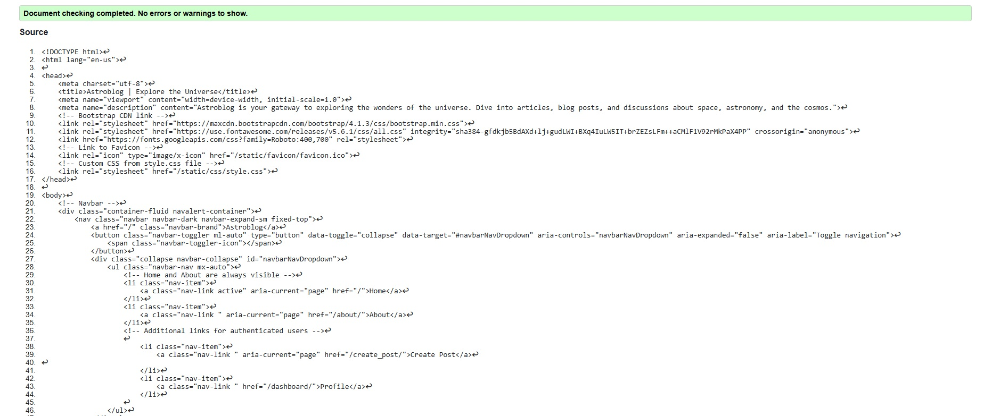
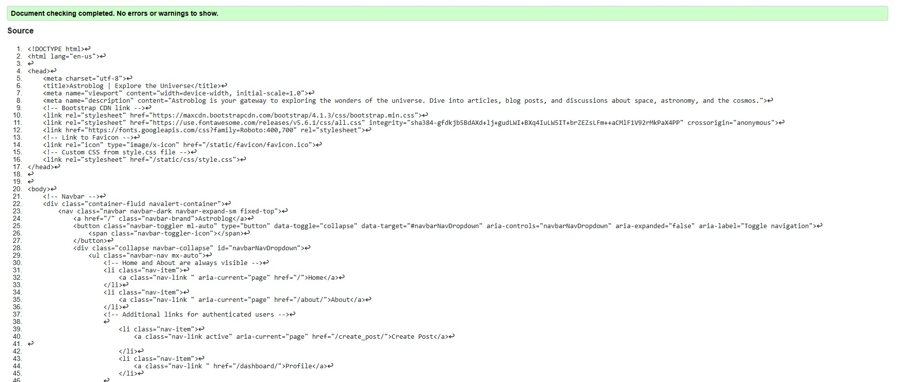
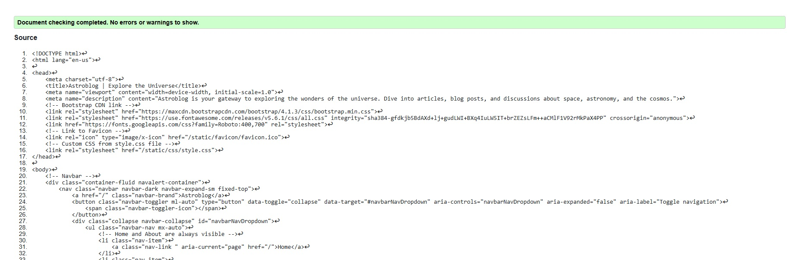
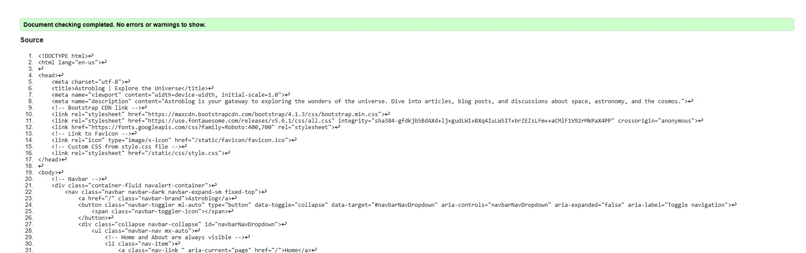
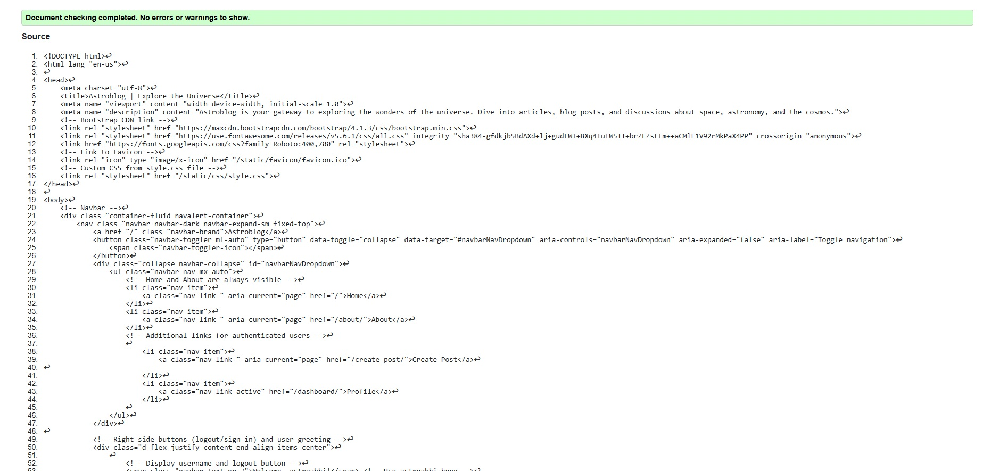
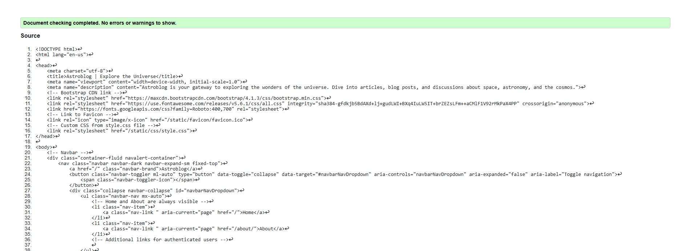
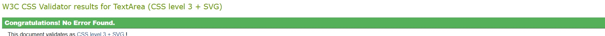

Return to the [README.md](README.md) file.

## Table of Contents

Click here for Table of Contents

- [Validation](#validation)

- [Lighthouse](#lighthouse)

- [User Story Testing](#user-story-testing)

- [Input Testing](#input-testing)

- [Manual Testing](#manual-testing)

- [User Validation Testing](#user-validation-testing)

- [Bugs](#bugs)

## Validation 
- This will show that the code is completely validated and correctly placed.

### HTML

| Page | URL | Screenshot | Notes |
| :---: | :---: | :---: | :---: |
| home | [W3C](https://validator.w3.org/) |  | Passed all checks |
| createpost | [W3C](https://validator.w3.org/) |  | Passed all checks |
| editpost | [W3C](https://validator.w3.org/) |  | Passed all checks |
| detailed posts | [W3C](https://validator.w3.org/) |  | Passed all checks |
| profile | [W3C](https://validator.w3.org/) |  | Passed all checks |
| sign in | [W3C](https://validator.w3.org/) |  | Passed all checks |
| sign out | [W3C](https://validator.w3.org/) |  | Passed all checks |

- The about page uses crispyform styling from the django admin to create the page and it makes its own tags like font which wasnt compatible with W3C. The site works perfectly and it looks perfect.

### CSS

| Page | Jigsaw URL | Screenshot | Notes |
| :---: | :---: | :---: | :---: |
| style.css | [Jigsaw](https://jigsaw.w3.org/css-validator/validator) |  | Passed all checks |

### JavaScript

| Page | JS Hint URL | Screenshot | Notes |
| :---: | :---: | :---: | :---: |
| script.js | [JS Hint](https://jshint.com/) |  | This has passed all checks, the two unused functions that can be seen stated are not an error in the JS code. It is simply because those functions are not being called upon at the current moment. |

### Python

| File | URL | Screenshot | Notes |
| :---: | :---: | :---: | :---: |
|  | [CI Python Linter](https://pep8ci.herokuapp.com/#) |  | Passed all checks |

## Lighthouse
- This is the lighthouse testing section for all of the pages. 

| Page   | Mobile                                                                                  | Desktop                                                                                   | Notes                                                                                                                                                                         |
| :----: | :-------------------------------------------------------------------------------------: | :---------------------------------------------------------------------------------------: | :---------------------------------------------------------------------------------------------------------------------------------------------------------------------------- |
| base.html/index.html |  |  | The low scores in best practices are because of Cloudinary and users posting their images for the blogs. |
| detailed_posts.html |  |  | The scores are overall very high. |
| about |  |  | The performance is low due to the high render images however the rest is very good practice and SEO |
| create post |  |  | High Performance in the sight!. |
| edit post |  |  | High Performance in the sight!. |
| profile |  |  | The low scores are due to users being able to upload their own images thats the reason for the performance and best practices being low. Cloudinary causes bad performance due to the level of images. |
| sign out |  |  | Very high performance and SEO! |
| sign in |  |  | page works very well |
| sign up |  |  | near perfect |

- The pages work very well considering how many images are being passed in the blog. Cloudinary does cause alot of these performance and best practice issues it is important to remember that.