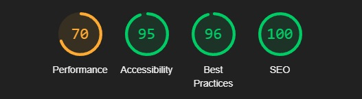
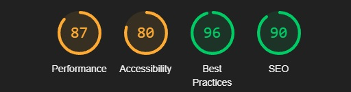
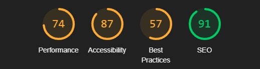
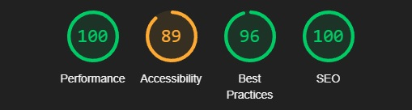
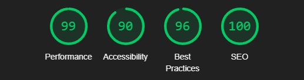
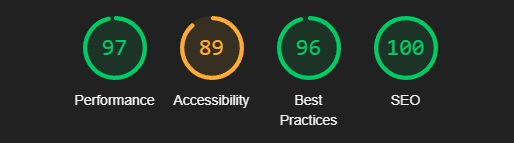

Return to the [README.md](README.md) file.

## Table of Contents

Click here for Table of Contents

- [Validation](#validation)

- [Lighthouse](#lighthouse)

- [Manual Testing](#manual-testing)

- [Bugs](#bugs)

## Validation 
- This will show that the code is completely validated and correctly placed.

### HTML

| Page | URL | Screenshot | Notes |
| :---: | :---: | :---: | :---: |
| home | [W3C](https://validator.w3.org/) |  | Passed all checks |
| createpost | [W3C](https://validator.w3.org/) |  | Passed all checks |
| editpost | [W3C](https://validator.w3.org/) |  | Passed all checks |
| detailed posts | [W3C](https://validator.w3.org/) |  | Passed all checks |
| profile | [W3C](https://validator.w3.org/) |  | Passed all checks |
| sign in | [W3C](https://validator.w3.org/) |  | Passed all checks |
| sign out | [W3C](https://validator.w3.org/) |  | Passed all checks |

- The about page uses crispyform styling from the django admin to create the page and it makes its own tags like font which wasnt compatible with W3C. The site works perfectly and it looks perfect.

### CSS

| Page | Jigsaw URL | Screenshot | Notes |
| :---: | :---: | :---: | :---: |
| style.css | [Jigsaw](https://jigsaw.w3.org/css-validator/validator) |  | Passed all checks |

### JavaScript

| Page | JS Hint URL | Screenshot | Notes |
| :---: | :---: | :---: | :---: |
| comments.js | [JS Hint](https://jshint.com/) |  | Passed all checks |

### Python

| File | URL | Screenshot | Notes |
| :---: | :---: | :---: | :---: |
| about/admin.py | [CI Python Linter](https://pep8ci.herokuapp.com/#) |  | Passed all checks |
| about/urls.py | [CI Python Linter](https://pep8ci.herokuapp.com/#) |  | Passed all checks |
| about/models.py | [CI Python Linter](https://pep8ci.herokuapp.com/#) |  | Passed all checks |
| about/views.py | [CI Python Linter](https://pep8ci.herokuapp.com/#) |  | Passed all checks |
| blog/admin.py | [CI Python Linter](https://pep8ci.herokuapp.com/#) |  | Passed all checks |
| blog/urls.py | [CI Python Linter](https://pep8ci.herokuapp.com/#) |  | Passed all checks |
| blog/models.py | [CI Python Linter](https://pep8ci.herokuapp.com/#) |  | Passed all checks |
| blog/views.py | [CI Python Linter](https://pep8ci.herokuapp.com/#) |  | Passed all checks |
| blog/forms.py | [CI Python Linter](https://pep8ci.herokuapp.com/#) |  | Passed all checks |
| dashboard/urls.py | [CI Python Linter](https://pep8ci.herokuapp.com/#) |  | Passed all checks |
| dashboard/views.py | [CI Python Linter](https://pep8ci.herokuapp.com/#) |  | Passed all checks |
| astroblog/urls.py | [CI Python Linter](https://pep8ci.herokuapp.com/#) |  | Passed all checks |

## Lighthouse
- This is the lighthouse testing section for all of the pages. 

| Page   | Mobile                                                                                  | Desktop                                                                                   | Notes                                                                                                                                                                         |
| :----: | :-------------------------------------------------------------------------------------: | :---------------------------------------------------------------------------------------: | :---------------------------------------------------------------------------------------------------------------------------------------------------------------------------- |
| base.html/index.html |  |  | The low scores in best practices are because of Cloudinary and users posting their images for the blogs. |
| detailed_posts.html |  |  | The scores are overall very high. |
| about |  |  | The performance is low due to the high render images however the rest is very good practice and SEO |
| create post |  |  | High Performance in the sight!. |
| edit post |  |  | High Performance in the sight!. |
| profile |  |  | The low scores are due to users being able to upload their own images thats the reason for the performance and best practices being low. Cloudinary causes bad performance due to the level of images. |
| sign out |  |  | Very high performance and SEO! |
| sign in |  |  | page works very well |
| sign up |  |  | near perfect |

- The pages work very well considering how many images are being passed in the blog. Cloudinary does cause alot of these performance and best practice issues it is important to remember that.

## Manual Testing

### Home Page

| Element | Expected Outcome | Pass/Fail | Notes |
|---|---|---|---|
| Post Previews | Posts are shown as preview cards, displaying the image, title, author, date, and excerpt | Pass |  |
| Default Image | Posts displayed with a default image if no custom image has been provided | Pass |  |
| Clickable Cards | Clicking on a preview card will open the full-page post view | Pass |  |
| Pagination | Users can browse posts across multiple pages | Pass |  |

#### About 

| Element | Expected Outcome | Pass/Fail | Notes |
|---|---|---|---|
| About View | Users will be able to see the sites about view with the status and the created_on date | Pass |  |
| Availability | Users can access the *About* page without needing to log in | Pass |  |
| Backend Management | The contents of the *About* page can be managed in the */admin* panel |  |

#### *Full-Page Post Views* 

| Element | Expected Outcome | Pass/Fail | Notes |
|---|---|---|---|
| Full-Page View | Blog posts are displayed on a full page, showing the title, author, date, and content and a comment section | Pass |  |
| Edit Button | User can edit their own blog posts when they click on it. | Pass | This button is only available after successful login and the user is the only author. |
| Comment Section | There is a dedicated comment section for every single post in the Astroblog blog.  | Pass | The comment section can be seen by all even guests but guests cant comment only users can. |
| *Favourite Post* Button | Users are redirected to their profile if they save a post that they like from another user | Pass | There is an alert that pops up for a user when they favourite a post |
| Delete Post | A *Confirmation* modal pops up asking users to confirm post deletion | Pass | This is only visible to the author of a post |

#### *Create a New Post* 

| Element | Expected Outcome | Pass/Fail | Notes |
|---|---|---|---|
| Form | An empty form is loaded | Pass |  |
| Text Editor | Users can apply stylings to the content of their posts using the editor | Pass |  |
| Title | Users have to post a title. | Pass | An error message will appear if the title is not there directing them to add a title |
| Optional excerpt | Posts can be created without an excerpt | Pass |  |
| Optional image | Posts can be created without an image | Pass |  |
| *Confirmation* Message | A confirmation message displays after successfully creating a post | Pass |  |
| Post Redirection | Users are redirected to the home page where they can see that they're post has been saved when they set the published status on the post if its a draft it sits in their profile | Pass |  |

#### *Edit Your Post* 

| Element | Expected Outcome | Pass/Fail | Notes |
|---|---|---|---|
| Form | The form is prepopulated with the existing information | Pass |  |
| Text Editor | Users can apply stylings to the content of their posts using the editor | Pass |  |
| Title | Users need to choose a unique title for their post | Pass | An error message will appear if the title is not selected telling them they must fill it in. |
| Slug Cant Change | Users cannot change the slug of their post. This is to ensure error 404 does not happen. | Pass | The slug field is not included in the edit option like it is in the create a post. |
| Optional excerpt | Posts can be created without an excerpt | Pass |  |
| Optional image | Posts can be created without an image | Pass |  |

#### *Profile* 

| Element | Expected Outcome | Pass/Fail | Notes |
|---|---|---|---|
| List View | Users can view all their saved posts in one place either published or drafts | Pass |  |
| List View | Saved posts automatically appear on the Profile regardless if they are drafts and the user cant see it on the homepage. | Pass |  |
| Preview Cards | Saved posts appear as preview cards showing the title, author, and creation date of each post | Pass |  |
| *Unfavourite* Button | The user can unfavourite any saved posts that they have from other users that they have liked. They can unfavourite it and it will be removed from their user profile for their favourite posts. | Pass |  |
| Read More | Users can click on their posts with the Read More button in their profile and open it. | Pass |  |
| Comments | The users comments on Astroblog on various posts that they might have commented on shows up in the profile with the date, time and the content of the comment and post | Fail |  |

### Devices View

| Device               | Outcome                                             | Pass/Fail |
|----------------------|-----------------------------------------------------|-----------|
| Google Pixel 6a      | Slight delay in responsiveness under heavy load.   | Pass      |
| Samsung Galaxy Tab S8 | Perfect functionality and responsiveness.          | Pass      |
| Lenovo Yoga Tab 11   | Minor UI scaling issues in landscape mode.         | Pass      |
| Dell XPS 15          | Smooth appearance and responsiveness overall.      | Pass      |
| HP Spectre x360 14   | No issues with appearance or functionality.        | Pass      |
| OnePlus 11R          | Perfect responsiveness and appearance.             | Pass      |
| iPhone 14 Pro Max    | No issues with responsiveness or functionality.     | Pass      |

### Browser View

Browser | Outcome | Pass/Fail
| --- | --- | --- |
| Safari | No appearance, responsiveness, or functionality issues. | Pass |
| Google Chrome | No appearance, responsiveness, or functionality issues. | Pass |
| Microsoft Edge | No appearance, responsiveness, or functionality issues. | Pass |
| Mozilla Firefox | No appearance, responsiveness, or functionality issues. | Pass |
| JoyUI Native Browsers | No appearance, responsiveness, or functionality issues. | Pass |

- Every single browser loads Astroblog beautifully.

## Bugs

- This project has encountered various bugs during the development of the site. The most notable being issues with the buttons and the logic behind them, I have diligently fixed 99% of the issues but one persists in the delete post modal which is the generic browser one. 
- Astroblog's other bugs came in design and the use of the forms for creating and editing posts which were all fixed with the use of stylistic bootstrap and crispyforms.
- I completely understand that anybody can come and post unrelated or graphically innapropriate content in the blog in its current release. This is understood but the reason why there isnt a validation for posts is to allow users to test the site and see that their posts are saving onto the home screen to get a feel for what Astroblog delivers.

- The removal of the slug in the edit blog post form was a way to make sure that a user never faces a 404 error when they edit their posts. The slug never changes after the creation and the user creates their own slug. This is a smart way to stop the 404 error taking place because all posts urls are slugs if anybody changed theirs in edit then it would return a 404. This was fixed. 

[Return to Readme](README.md)